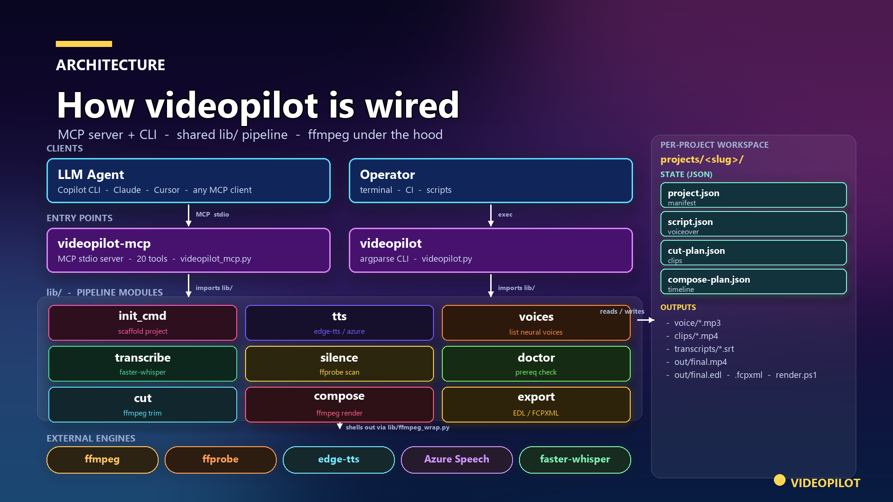

# videopilot

> Agent-driven video creation toolkit. An **MCP server** giving LLMs 20 tools
> to author voiceover, cut highlights, compose timelines, and render finished
> MP4s — plus a CLI for manual / scripted runs when you don't want an agent
> in the loop.

[](https://pypi.org/project/videopilot/)
[](https://www.python.org)
[](LICENSE)
[](https://ffmpeg.org)

`videopilot` is an **MCP (Model Context Protocol) server** that lets a calling
LLM — driven by GitHub Copilot CLI or any other MCP-aware client — turn raw
screen recordings into narrated, edited MP4s. The server exposes 20 tools
covering the full pipeline: neural TTS voiceover, faster-whisper
transcription, silence detection, clip cutting, timeline composition with
slides and audio ducking, and NLE export to EDL / FCPXML.

The MCP server is the **primary interface**. A standalone `videopilot` CLI
ships alongside it for manual or scripted runs — useful for one-off stages,
CI, or workflows without an agent in the loop.

```
source.mp4  ->  script.json  ->  tts  ->  cut-plan.json  ->  cut  ->  compose-plan.json  ->  compose  ->  final.mp4
                                                                                                          + EDL / FCPXML / replay script
```

## Architecture



Two clients (an LLM driving the MCP server, or you driving the CLI) talk
to two entry points (`videopilot-mcp` and `videopilot`). Both entry points
import the same `lib/` pipeline modules, which read and write per-project
JSON state files and shell out to ffmpeg, edge-tts, Azure Speech, and
faster-whisper via `lib/ffmpeg_wrap.py`. Regenerate this image with
`python assets/make_arch.py`.

## Highlights

| Capability | Engine |
|---|---|
| Neural voiceover, 400+ voices, 100+ locales | [Microsoft Edge TTS](https://github.com/rany2/edge-tts) (free, no key) |
| Premium neural voices | Azure Speech (optional, with key) |
| Word-level transcription | [faster-whisper](https://github.com/SYSTRAN/faster-whisper) (local) |
| Silence trimming, scene cuts | ffmpeg |
| Title slides, picture-in-picture, audio ducking, music underlay | ffmpeg filter graph composer |
| Ken Burns motion on still images (zoom in/out, pan) | ffmpeg `zoompan` over a Lanczos-oversampled source (subpixel-smooth) |
| MP4 render at any resolution / fps | ffmpeg |
| Hand-off to Premiere / Resolve / Final Cut | EDL (CMX 3600) + FCPXML export |
| Replayable render scripts | PowerShell / bash export |
| Agent integration | MCP server with 20 tools — see [MCP tools](#mcp-tools) |
| Authoring contract | JSON state files documented in [`AGENT.md`](AGENT.md) (incremental authoring, schema introspection, idempotency probes) |

## Install

VideoPilot is a Python package on PyPI. Pick one of the two paths below —
install once with `pip` and let your MCP client launch the installed entry
point, or skip the install entirely and let `uvx` run the latest release in
an ephemeral environment on demand.

**Install ffmpeg first.** Both paths need `ffmpeg` on `PATH` *before*
you point your agent at videopilot — otherwise `doctor` (the first
tool the agent will call) fails, and most agents will then try to
install ffmpeg for you, which is rarely what you want:

| OS | Command |
|---|---|
| Windows | `winget install --id Gyan.FFmpeg -e` |
| macOS | `brew install ffmpeg` |
| Debian / Ubuntu | `sudo apt install ffmpeg` |
| Fedora | `sudo dnf install ffmpeg` |
| Arch | `sudo pacman -S ffmpeg` |

### Option 1 — `pip install` (recommended)

Install the package from PyPI:

```
pip install videopilot
```

Two console scripts are placed on `PATH`:

| Script | Purpose |
|---|---|
| `videopilot-mcp` | The MCP server (stdio transport). Point your MCP client at this. |
| `videopilot` | The manual CLI. Useful for one-off stages, CI, and the `doctor` check below. |

Verify the install. `videopilot doctor` exits 0 when ffmpeg, ffprobe,
Python deps, and optional Azure keys are all in order; otherwise it prints
exactly what's missing:

```
videopilot doctor
```

Then wire the installed entry point into your MCP client. The verified
config for the GitHub Copilot CLI (`~/.copilot/mcp-config.json`) is:

```json
{
  "mcpServers": {
    "videopilot": {
      "type": "stdio",
      "command": "videopilot-mcp",
      "args": [],
      "tools": ["*"]
    }
  }
}
```

Any MCP-aware client that supports stdio servers can launch
`videopilot-mcp` the same way — consult your client's docs for the exact
config-file location and schema.

### Option 2 — `uvx` (no install)

If you'd rather not install `videopilot` globally, point your MCP client
at `uvx` and it will fetch the latest release from PyPI into an ephemeral
environment on demand:

```json
{
  "mcpServers": {
    "videopilot": {
      "type": "stdio",
      "command": "uvx",
      "args": ["--from", "videopilot", "videopilot-mcp"],
      "tools": ["*"]
    }
  }
}
```

This skips the global install, but you won't have the `videopilot` CLI
handy locally for diagnostics like `videopilot doctor` — the same check
is also exposed as the `doctor` MCP tool, so your agent can run it for
you on its very first call.

### Talk to your agent

After your MCP client restarts, the agent can call any of the 20
`videopilot.*` tools listed [below](#mcp-tools). Just describe the video
you want — the agent picks the tools and the order. Two examples:

> Make a 60-second narrated explainer about videopilot with three title
> slides and a voiceover tying them together.

> Take the 10-minute raw recording at `~/Recordings/raw.mp4` and turn it
> into an interesting 60-second highlight reel with a voiceover.

The `schema` MCP tool returns the authoritative JSON schemas for every
state file inside the running server, so the agent always has the
contract available. For prose narrative on tool order and call patterns,
see [`AGENT.md`](https://github.com/mbahgatTech/videopilot/blob/main/AGENT.md)
on GitHub (it isn't bundled with the installed package — fetch it from
that URL if your agent wants it).

### From source (development)

```
git clone https://github.com/mbahgatTech/videopilot.git
cd videopilot
pip install -e .
```

## MCP tools

| Tool | Purpose |
|---|---|
| `doctor` | Verify ffmpeg, ffprobe, Python deps, optional Azure keys. |
| `voices` | List available neural TTS voices (Edge TTS or Azure). |
| `list_projects` | List all projects under `projects/`. |
| `project_status` | Pipeline status for one project: which JSON state files exist, which stages have run. |
| `init` | Create a new project, optionally with a first source video. |
| `import_source` | Add another source to an existing project. |
| `read_state` | Read a JSON state file (`project` / `script` / `cut-plan` / `compose-plan`). |
| `write_state` | Write a JSON state file with schema validation. |
| `tts` | Synthesize voiceover MP3s from `script.json` (async, emits progress notifications). |
| `transcribe` | Run faster-whisper; returns word-level segments and writes SRT. |
| `silence` | Emit a cut-plan candidate that strips silence. |
| `cut` | Cut clips per `cut-plan.json`. |
| `compose` | Render final MP4 per `compose-plan.json`. |
| `export` | Emit NLE projects (EDL, FCPXML) and replayable ffmpeg script. |
| `schema` | Return JSON schemas (agent-facing) for every state file. |
| `add_vo_segment` | Append or upsert a voiceover segment in `script.json`. |
| `add_slide` | Append a slide entry (with optional body text) to `compose-plan.json`. |
| `set_compose_output` | Set compose output resolution / fps / codec. |
| `preview_slide` | Render a single slide as a PNG for fast preview without running `compose`. |
| `is_up_to_date` | Probe whether a stage's outputs are current for its inputs (idempotency check). |

The contract — what each tool reads and writes, the JSON state-file schemas,
and the recommended call order — is documented in [`AGENT.md`](AGENT.md).
Calling agents should read `AGENT.md` before issuing tool calls.

## CLI reference (manual mode)

Each pipeline stage is also exposed as a `videopilot` CLI subcommand. Use it
when you want to run a step by hand, drop the agent, or invoke from CI.

| Command | Purpose |
|---|---|
| `videopilot doctor` | Verify ffmpeg, ffprobe, Python deps, optional Azure keys. |
| `videopilot voices [--locale en-US]` | List available TTS voices. |
| `videopilot init <slug> [--source PATH]` | Create a new project with optional first source. |
| `videopilot import <slug> <path>` | Add another source to an existing project. |
| `videopilot tts <slug> [--force]` | Synthesize voiceover MP3s from `script.json`. |
| `videopilot transcribe <slug> <source-id>` | Run faster-whisper; emits word-level JSON + SRT. |
| `videopilot silence <slug> <source-id>` | Emit a cut-plan candidate that strips silence. |
| `videopilot cut <slug> [--force] [--reencode]` | Cut clips per `cut-plan.json`. |
| `videopilot compose <slug>` | Render final MP4 per `compose-plan.json`. |
| `videopilot export <slug> [--edl] [--fcpxml] [--script]` | Emit NLE projects + replayable ffmpeg script. |

Run `videopilot <command> --help` for per-command flags.

### Manual quick start

```
# 1. Create a project with a source video
videopilot init demo --source "/path/to/raw-recording.mp4"

# 2. Hand-author projects/demo/script.json (one segment per beat of narration),
#    OR have your agent draft it from AGENT.md.

# 3. Synthesize the voiceover
videopilot tts demo

# 4. (Optional) transcribe to help pick highlights
videopilot transcribe demo raw1

# 5. Hand-author projects/demo/cut-plan.json (which spans to keep)

# 6. Cut clips from sources
videopilot cut demo

# 7. Hand-author projects/demo/compose-plan.json (timeline + slides + ducking)

# 8. Render the final video
videopilot compose demo

# 9. Optional: emit NLE projects + replay script
videopilot export demo --edl --fcpxml --script
```

Final output: `projects/demo/out/final.mp4` plus optional `final.edl`,
`final.fcpxml`, and `render.ps1`.

## Project layout

```
videopilot/
- AGENT.md           <- contract for calling LLMs (start here if you're driving the tool)
- README.md          <- this file
- LICENSE            <- MIT
- pyproject.toml
- videopilot_mcp.py  <- MCP server (primary entry point; console-script: videopilot-mcp)
- videopilot.py      <- argparse router (CLI implementation)
- videopilot_cli.py  <- console-script shim for the CLI
- lib/               <- shared implementation modules
  - tts.py
  - transcribe.py
  - silence.py
  - cut.py
  - compose.py
  - export.py
  - ffmpeg_wrap.py
  - voices.py
  - init_cmd.py
  - doctor.py
- examples/          <- copyable starter JSON state files
- tests/             <- standalone test scripts (mcp_e2e.py, progress_smoke.py)
- projects/<slug>/   <- per-project workspace (one folder per video)
  - project.json
  - script.json
  - cut-plan.json
  - compose-plan.json
  - sources/
  - voice/
  - transcripts/
  - clips/
  - tmp/
  - out/
```

## Configuration

| Environment variable | Purpose |
|---|---|
| `AZURE_SPEECH_KEY` | Optional. Enables Azure Speech voices (premium neural TTS). |
| `AZURE_SPEECH_REGION` | Required when `AZURE_SPEECH_KEY` is set (e.g. `eastus`). |

Edge TTS is the default and requires no configuration.

## Development

```
git clone https://github.com/mbahgatTech/videopilot.git
cd videopilot
pip install -e ".[dev]"

# Build the package
python -m build

# Validate the dist
python -m twine check dist/*

# Local smoke test
videopilot doctor

# MCP server stdio + progress-notification smoke test
python tests/progress_smoke.py

# End-to-end MCP test (real ffmpeg + Edge TTS + full pipeline)
python tests/mcp_e2e.py
```

## Releasing

Releases publish to PyPI automatically when a `v*` tag is pushed. The
version is derived from the tag itself via
[setuptools_scm](https://setuptools-scm.readthedocs.io/) — there is no
`version =` line in `pyproject.toml` and no version-bump commit is required.

The workflow uses [PyPI **Trusted Publishing** (OIDC)](https://docs.pypi.org/trusted-publishers/),
so **no API tokens are stored in the repo or in GitHub Secrets** — PyPI
verifies the GitHub OIDC token at publish time.

One-time setup (PyPI side, done once before the first release):

1. Sign in to <https://pypi.org/>.
2. Account settings → Publishing → **Add a new pending publisher**:
   - PyPI project name: `videopilot`
   - Owner: `mbahgatTech`
   - Repository: `videopilot`
   - Workflow filename: `release.yml`
   - Environment name: `pypi`
3. On GitHub, repo Settings → Environments → **New environment** → `pypi`.
   Optionally add a required reviewer for an extra approval gate.

Cutting a release:

```
git tag v0.2.0
git push origin v0.2.0
```

That's it. The `release` workflow then:

1. Builds sdist + wheel (version derived from the tag)
2. Verifies the tag matches the `setuptools_scm`-derived version
3. Runs `twine check`
4. Publishes to PyPI via OIDC
5. Creates a GitHub Release with the sdist + wheel attached

## License

MIT. See [`LICENSE`](LICENSE).
